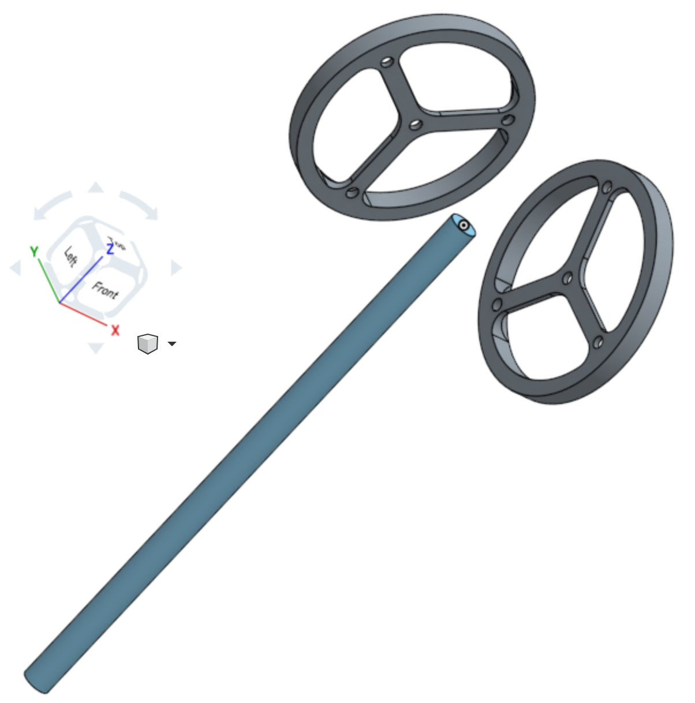
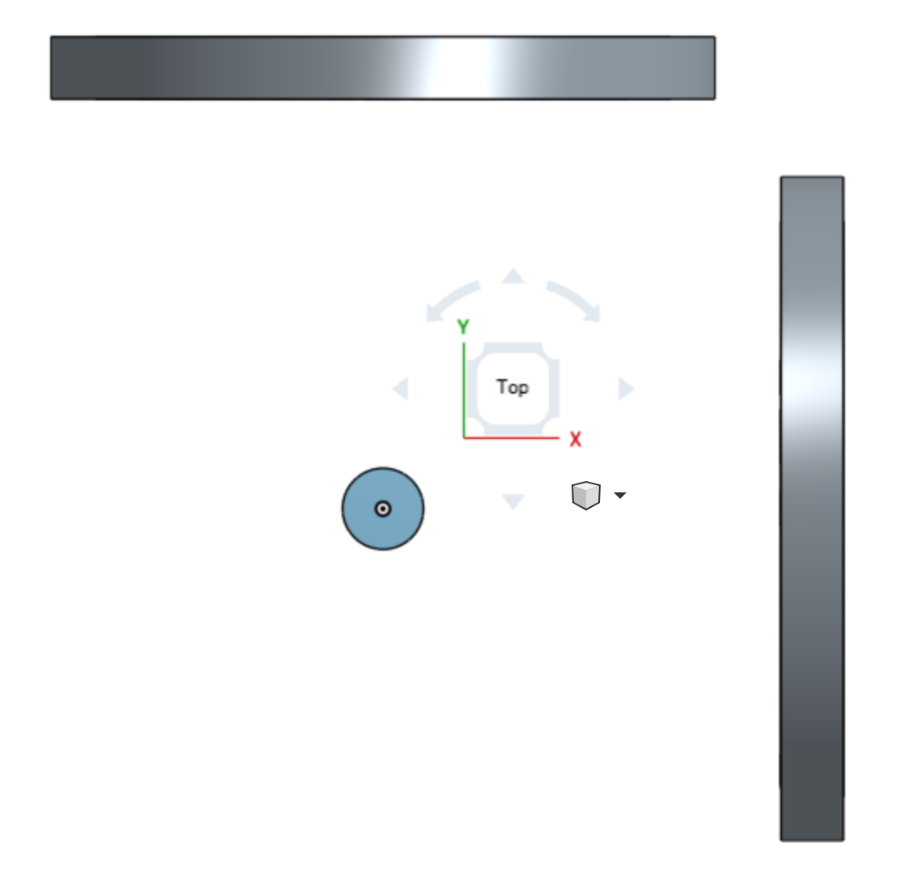
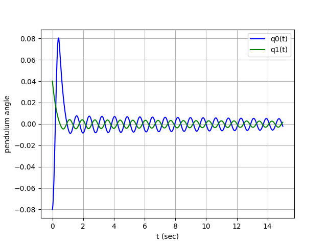

# Reaction Wheel Stabilized Inverted Pendulum
An inverted pendulum that maintains an upright attitude via reaction wheels. This repository
contains hardware and software development files. See the pdf for system equations.

Renderings: 
 | 

Simulation output: 
 

**Sim Test Conditions** 
Software: Python 3.6.4 on macOS High Sierra 
Computer: MacBook (Retina, 12-inch, Early 2015) 
Processor: 1.1 GHz Intel Core M 
RAM: 8 GB 1600 MHz DDR3 
